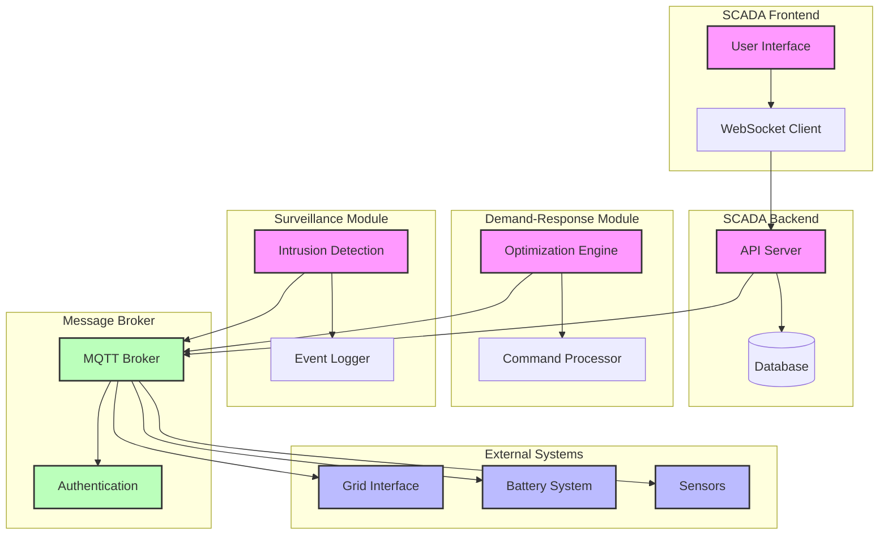

## System Components

### 1. SCADA Frontend
- User Interface: Real-time monitoring and control
- WebSocket Client: Real-time data updates

### 2. SCADA Backend
- API Server: Request handling and processing
- Database: State persistence and historical data

### 3. Demand-Response Module
- Optimization Engine: Load and cost optimization
- Command Processor: Device control and management

### 4. Surveillance Module
- Intrusion Detection: Security monitoring
- Event Logger: System activity tracking

### 5. Message Broker
- MQTT Broker: Message routing and delivery
- Authentication: Security and access control

### 6. External Systems
- Grid Interface: Utility grid interaction
- Battery System: Energy storage management
- Sensors: Real-time data collection 